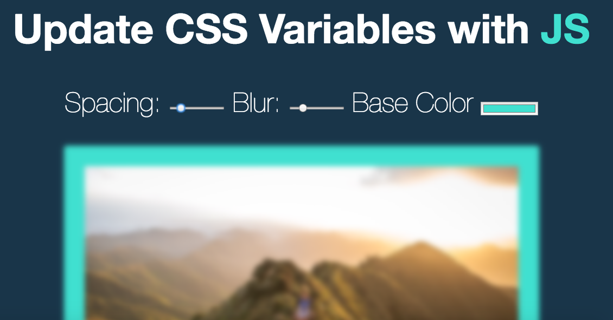

# _Scoped CSS_

#### _{Use the new CSS variables and Javascript to make real-time changes to css attributes!}, {Jan 25th, 2017}_

#### By _**Kyle Lange**_

## Learnings

* you can make a slider in HTML:
<input id="spacing" type="range" name="spacing" min="10" max="200" value="10" data-sizing="px">
The min and max values set the parameters.

* you can also get the color picker to show up in an input with: <input id="base" type="color" name="base" value="#ffc600">
Use type color and give a base value, and you are good to go!

* CSS VARIABLES!
      1. make a :root {} where inside it, you set some vars like: --baseColor: #40e0d0;

      2. then use it where you like as: background-color: var(--baseColor);

* EVENT LISTENER types:
.addEventListener('change', functionHere);
.addEventListener('mousemove', functionHere);

* this lesson uses HTML data-* again.  The word after data is a variable you set, then you pass a value (="px") that you can use in your JavaScript.

* one can use the data from data-*  by using this.dataset in a function.  this.dataset returns an OBJECT that holds all the values paired to data-* . In this repo, this.dataset gives you "px"

*

## Setup/Installation Requirements

1. Download this repo using your terminal: git clone repo-name pasted here

2. View the code by drag-and-dropping the file into your [favorite text editor](https://atom.io)

3. run/check-out the program by dropping the index/html file from your folder into your web browser

## Known Bugs

_There are no known bugs as of the last commit. Please send an ISSUE on github in the repository if you see something I have not._

## Support and contact details

For questions or comments, please __email  [Kyle here.](baronsintrees@gmail.com)__

## Technologies Used

* HTML5
* CSS3
* Vanilla JavaScript

### License

Copyright (c) 2016 **_Kyle Lange_**

This program is free software: you can redistribute it and/or modify
    it under the terms of the GNU General Public License as published by
    the Free Software Foundation, either version 3 of the License, or
    (at your option) any later version.

    This program is distributed in the hope that it will be useful,
    but WITHOUT ANY WARRANTY; without even the implied warranty of
    MERCHANTABILITY or FITNESS FOR A PARTICULAR PURPOSE.  See the
    GNU General Public License for more details.

    You should have received a copy of the GNU General Public License
    along with this program.  If not, see <http://www.gnu.org/licenses/>.
